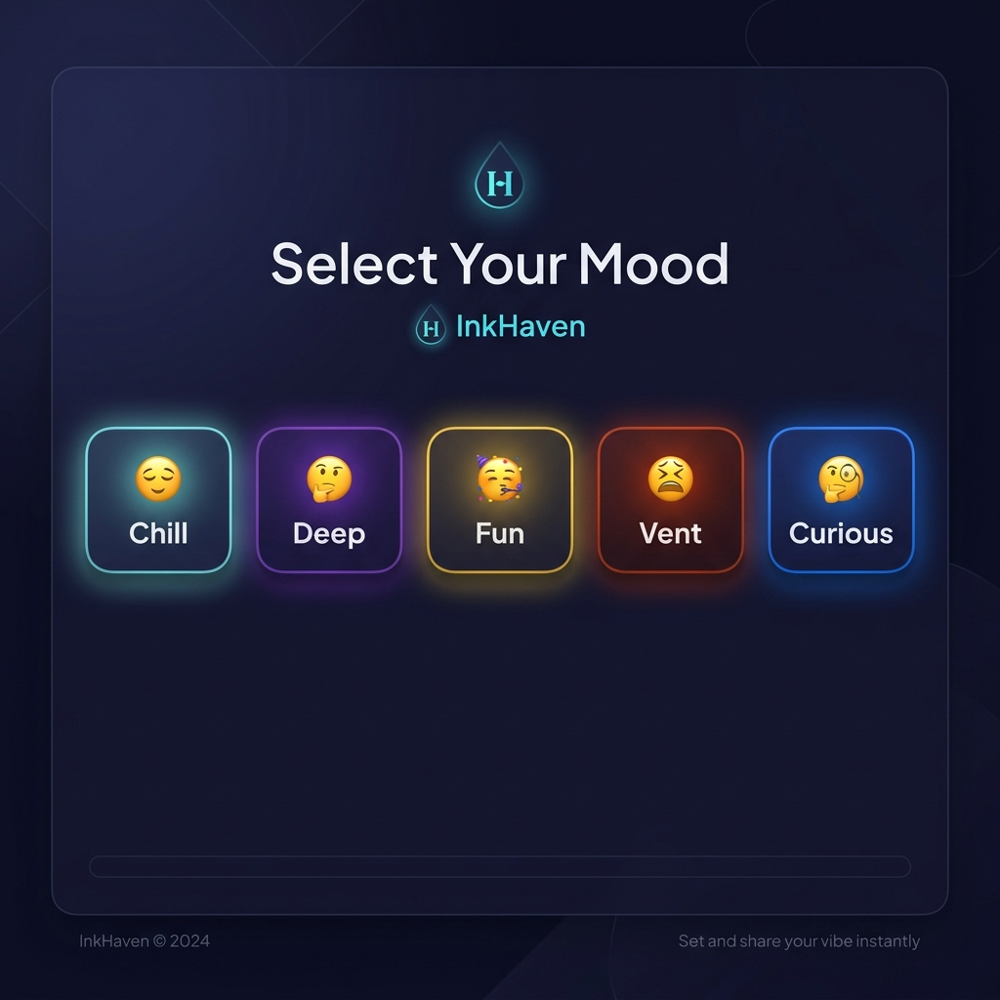
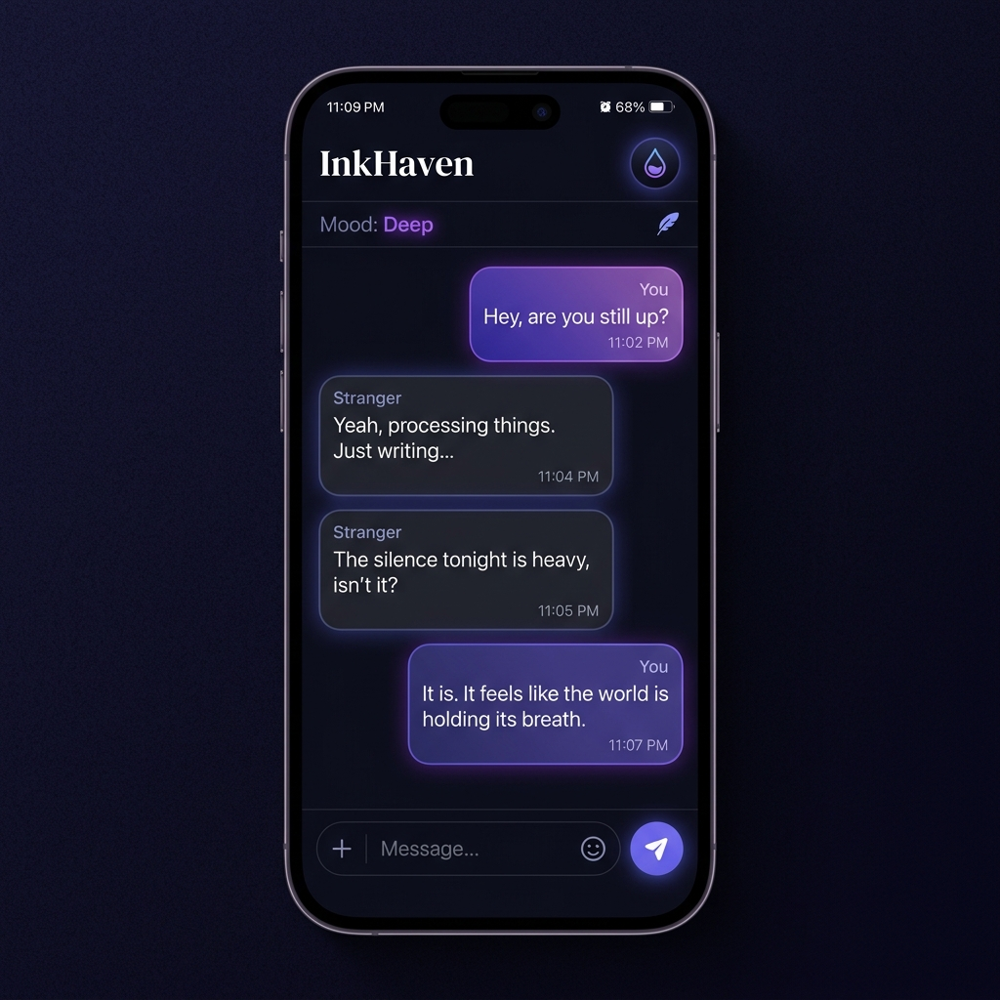

# 🎭 InkHaven: The Art of Anonymous Connection

<div align="center">


### **Meet strangers. Stay anonymous. Find your vibe.**

[](https://nextjs.org/)
[](https://react.dev/)
[](https://supabase.com/)
[](https://tailwindcss.com/)
[](https://typescriptlang.org/)

[🌐 Live Demo](https://www.inkhaven.in) • [📖 Documentation](#-key-features) • [🐛 Report Bug](https://github.com/beyourselfalways878-prog/Inkhaven/issues)

</div>

---

## ✨ What is InkHaven?

InkHaven is a **privacy-first anonymous chat platform** designed for meaningful human connection. We believe that stripping away identities allows for more honest, vulnerable, and profound conversations. 

Unlike traditional "roulette" chats, InkHaven uses **Mood-Based Matching** to pair you with individuals who share your current state of mind—whether you're looking for a deep intellectual dive or just a casual laugh.

---

## 🚀 Key Features

### 🌈 Mood-Based Matching
Before entering the haven, select your vibe. Our algorithm ensures you're matched with someone on the same wavelength.

<div align="center">
  
</div>

- 😌 **Chill** — For relaxed, low-pressure conversations.
- 🌊 **Deep** — For soul-searching and philosophical debates.
- 🎉 **Fun** — For jokes, games, and lighthearted banter.
- 💭 **Vent** — For when you just need someone to listen.
- 🔮 **Curious** — For exploring new perspectives and ideas.

### 🤖 AI Wingman
Stuck on what to say next? Our **AI Wingman** (powered by Gemini 2.5 Flash) analyzes the conversation context and suggests 3 engaging icebreakers to keep the flow alive.

### 🛡️ Dual-Layer Moderation
Choose your experience:
- **Safe Mode**: Family-friendly, strict AI content filtering, and kid-safe environment.
- **18+ Mode**: Age-verified, standard moderation for mature conversations.

### ⭐ Karma & Reputation
A 4-tier reputation system that rewards positive interactions and helpfulness, fostering a healthy community of **Newcomers**, **Trusted** members, **Veterans**, and **Legends**.

---

## 📱 Visual Experience

<div align="center">
  
  <p><i>Sleek, minimalist, and focused on the conversation.</i></p>
</div>

---

## 🛠️ Tech Stack

| Layer | Technology |
|-------|------------|
| **Frontend** | [Next.js 15.1](https://nextjs.org/) (App Router), [React 19](https://react.dev/), [Tailwind CSS 4](https://tailwindcss.com/) |
| **Backend** | [Supabase](https://supabase.com/) (Postgres, Realtime, Auth, RLS) |
| **AI Engine** | [Google Gemini 2.5 Flash](https://ai.google.dev/) |
| **State Management** | [Zustand](https://github.com/pmndrs/zustand), [React Query](https://tanstack.com/query) |
| **Animation** | [Framer Motion](https://www.framer.com/motion/) |
| **Security** | [Upstash Redis](https://upstash.com/) (Rate Limiting), [hCaptcha](https://www.hcaptcha.com/) |

---

## 📦 Project Structure

```
inkhaven-chat/
├── app/                    # Next.js App Router (Pages, API, Layouts)
│   ├── api/               # AI Wingman, Moderation, Matching, Messages
│   ├── chat/              # Real-time chat room logic
│   └── quick-match/       # Mood selection & pairing logic
├── components/            # Atomic & Modular UI components
├── lib/                   # Supabase client, Business Logic, Shared Utils
├── public/                # Static assets & PWA icons
└── stores/                # Global state (Zustand)
```

---

## 🚀 Quick Start

### Prerequisites
- Node.js 18+
- Supabase Project

### Installation
1. **Clone the repository**
   ```bash
   git clone https://github.com/beyourselfalways878-prog/Inkhaven.git
   cd Inkhaven
   ```
2. **Install dependencies**
   ```bash
   npm install
   ```
3. **Configure Environment**
   ```bash
   cp .env.example .env.local
   # Fill in your NEXT_PUBLIC_SUPABASE_URL and KEYS
   ```
4. **Run Development Server**
   ```bash
   npm run dev
   ```

---

## 🔐 Security & Privacy
- **Anonymous-First**: No email or personal data required to chat.
- **Ephemeral Storage**: Messages are handled with privacy in mind.
- **End-to-End Logic**: Secure RLS (Row Level Security) on Supabase.
- **Rate-Limited**: Protection against spam and bots via Upstash.

---

## 🤝 Contributing
Contributions are welcome! Please see our [CONTRIBUTING.md](CONTRIBUTING.md) for guidelines on how to get involved.

---

## 📜 License
This project is currently **Proprietary**. All rights reserved © 2026 InkHaven.

---

<div align="center">
  <p>Built with 💜 for meaningful human connections.</p>
  <a href="https://www.inkhaven.in"><b>inkhaven.in</b></a>
</div>
